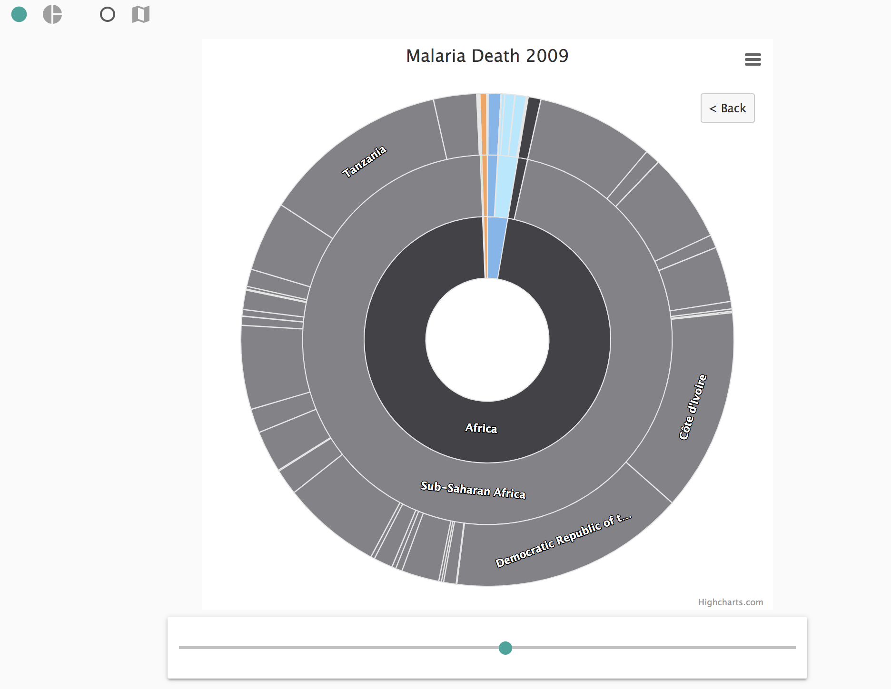
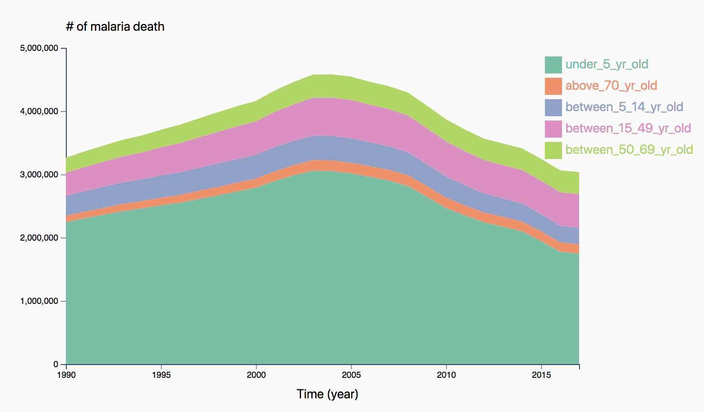
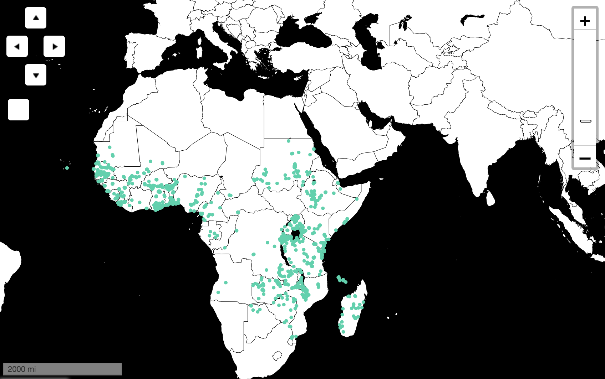
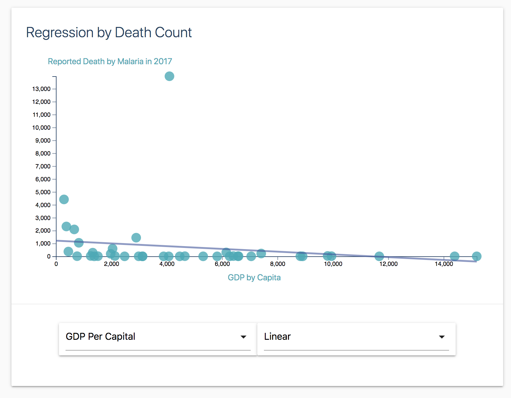

# Malaria-Detection-and-Prevention

In this project, I worked with 2 others to explore the following questions: How can we use machine learning tools to effectively detect and prevent Malaria? To answer these questions, we built a convolutional neural network model to detect the disease at the cellular level and various regression and classification
models to determine methods of control and prevention.

Malaria is a serious and sometimes fatal disease caused by a parasite that commonly infects a certain type of mosquito which feeds on humans. 
People who get malaria are typically very sick with high fevers, shaking chills, and flu-like illness.The World Health Organization (WHO) estimates that 438,000 people died because of malaria in 2015; the Institute of Health Metrics and Evaluation (IHME), Global Burden of Disease (GBD) puts this estimate at 620,000 in 2017. Children under five and pregnant women are particularly vulnerable to Malaria.
While Malaria could be life threatening, it is also preventable and treatable. Common preventive methods include using bite prevention, taking anti-malaria pills, and early diagnosis.A Malaria vaccine is going through clinial trials in multiple countries to provide protection from the parasite.

In the first section of the project, we created data visualizations to explore the prevalanece and distribution of Malaria around the world. 

