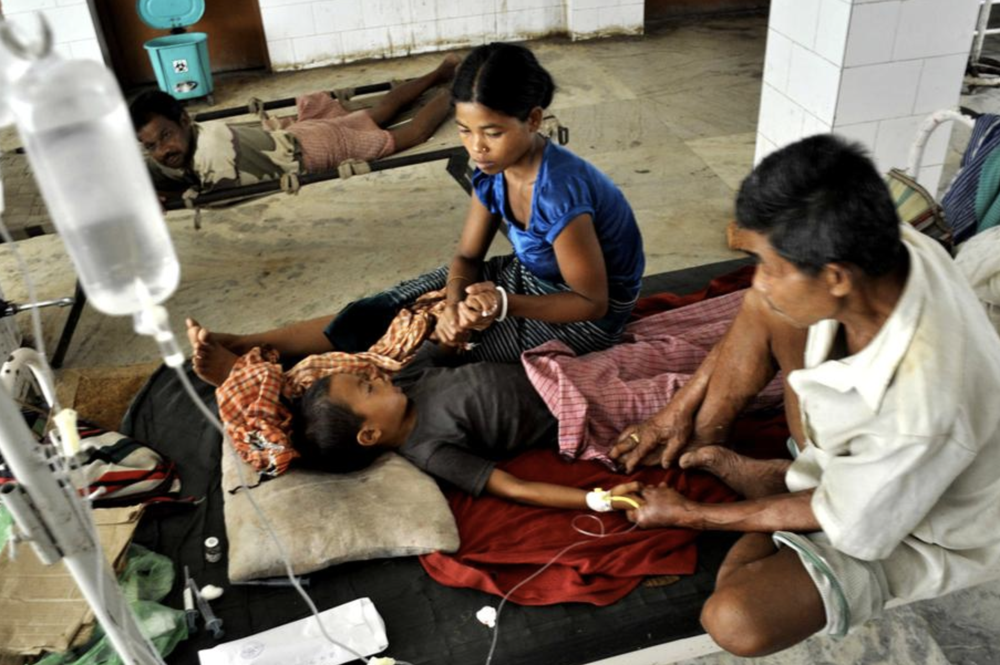

# Malaria-Detection-and-Prevention

In this project, I worked with 2 others to explore the following questions: How can we use machine learning tools to effectively detect and prevent Malaria? To answer these questions, we built a convolutional neural network model to detect the disease at the cellular level and various regression and classification
models to determine methods of control and prevention. Please see the complete online report through the following link: https://malaria-detection-prevention.herokuapp.com/

Malaria is a serious and sometimes fatal disease caused by a parasite that commonly infects a certain type of mosquito which feeds on humans. People who get malaria are typically very sick with high fevers, shaking chills, and flu-like illness.The World Health Organization (WHO) estimates that 438,000 people died because of malaria in 2015; the Institute of Health Metrics and Evaluation (IHME), Global Burden of Disease (GBD) puts this estimate at 620,000 in 2017. Children under five and pregnant women are particularly vulnerable to Malaria.
While Malaria could be life threatening, it is also preventable and treatable. Common preventive methods include using bite prevention, taking anti-malaria pills, and early diagnosis.A Malaria vaccine is going through clinial trials in multiple countries to provide protection from the parasite.

## Empirical View
In the first section of the project, we created data visualizations to explore the prevalanece and distribution of Malaria around the world. We first used Javascript D3 to create the following interactive chart that shows the distribution of Malaria incidences in different regions of the world over time. We learned from this chart that Malaria has been the most prevalent in African contries. 

When also created the following density chart using Javascript D3 to explore the number of death due to Malaria over time, statified by age groups. We found that children under five can be particularly vunlerable to Malaria. 

## Factors Associated with Malaria 

### Mosquitos
In this second section, we explored factors that are associated with the distribution of Malaria. To start with, there are four kinds of parasites that can infect humans with malaria via mosquito vectors, the Plasmodium falciparum, vivax, ovale, and malariae. Humans become infected with malaria when bitten by a parasitized female Anopheles mosquito. In order to design national malaria control and elimination programs, it is important to understand the distribution of the anopheline mosquitoes. The KEMRI-Wellcome Trust organization compiled a comprehensive dataset of all the published and unpublished studies that contain geocoded information on the anopheline mosquitoes in Africa. The following map shows the number of studies on those mosquitoes in Africa and where they were found.

### Social and environmental factors
The prevalence of Malaria is associated with many other social and environmental factors, including climate, economics, public health facilities, etc. We used linear and quadratic models to explore the how these factors are related to death caused by Malaria. We found that death due to Malaria decreases with higher annual GDP, but increases with higher average temperature and humidity.  

## Use Machine learning to Detect Malaria
We built a convolutional neural network model to predict which cell images are infected with malaria. The final sequential model has about 95% training accuracy and 93% validation accuracy. The input layer is a 2D convolutional layer, with 32 filters, 3x3 kernel size, 96x96x3 input shape, rectified linear activation function. The input layer is followed by batch normalization, 2D max pooling with a 2x2 pool size, and a 40% dropout rate in order to reduce overfitting. We put in two hidden 2D convolutional layers with similar specifications as the input layer; the first hidden layer has 64 filters. We added a flatten layer to reshape the tensor to 1D. This was followed up with a dense layer with 64 units, rectified linear activation, and a 40% dropout rate. The output layer is a dense layer with 1 unit and sigmoid activation. We compiled the model with an Adam optimizer, binary crossentropy loss function, and accuracy metric. In the model generator, we used 200 steps per epoch, 10 epochs, and 20 validation steps. To see our model building process more in depth, please visit our Github page: https://github.com/lhatpku/Project-3---Malaria-Detection-and-Prevention/blob/master/ml/Malaria_CNN.ipynb

